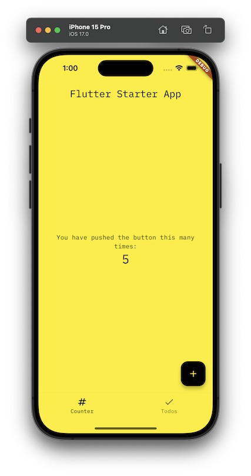
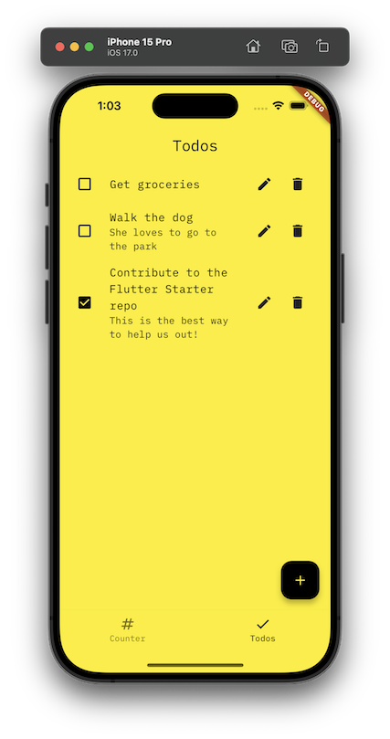
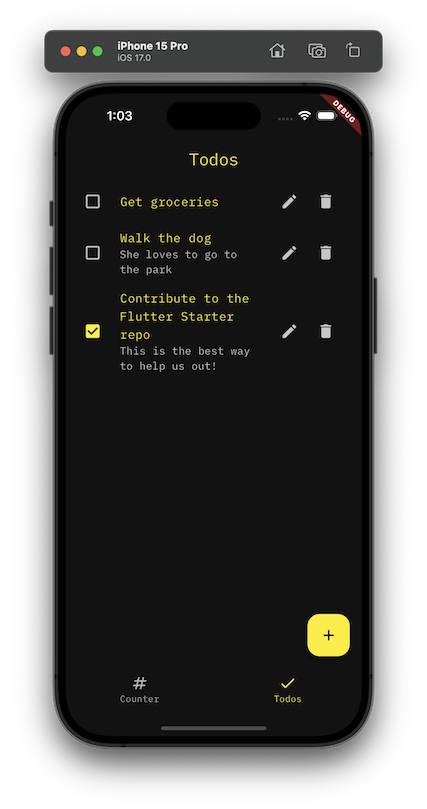
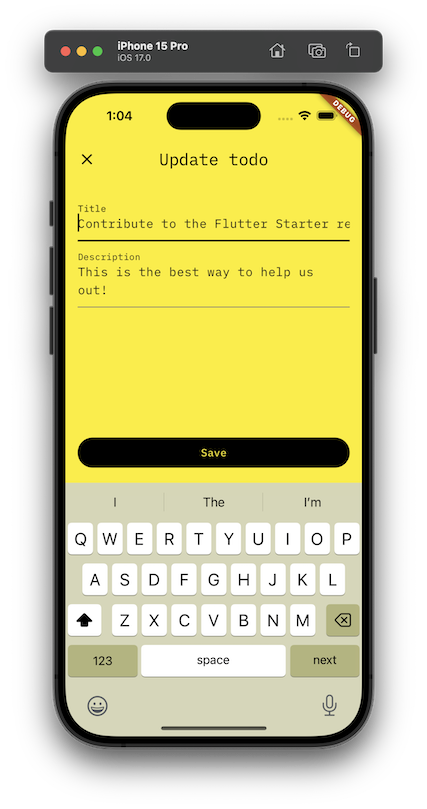
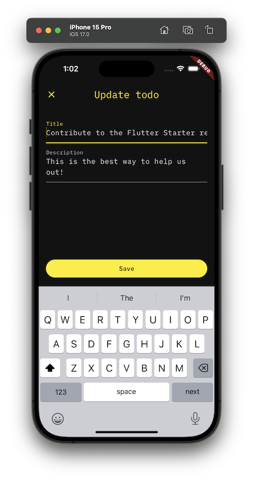

# Flutter Starter

A starter project for Flutter apps. This start setups up best practices for Flutter apps, including:
* Localization
* Theming
* CI/CD
* Testing
* Code generation
* Dependency injection and state management (via [Riverpod](https://riverpod.dev/))
* Linting and formatting
* Separate application layers implemented via sub-packages (e.g. `services`)

## Quick start

1. Clone this repo
2. Use [Hermit](https://cashapp.github.io/hermit/usage/get-started/) to install required dependencies (or manually install and setup [Flutter](https://docs.flutter.dev/get-started/install) and [Just](https://github.com/casey/just))
3. Run `just get` to install dependencies
4. Run `just run` to run the app

See [CONTRIBUTING.md](./CONTRIBUTING.md) for more details.

## TBD theme

The theme is defined in `lib/shared/theme.dart`. It is a `ThemeData` object that is used by the `MaterialApp` and setup during app initialization in  `lib/features/app/app.dart`.

> Note: The theme is currently a work in progress. In the future, we might move the theme out to a dedicated TBD Design System package.

### Example screens

#### Counter

  
  

#### Todos

  
  

  
  

## Project resources

| Resource                                   | Description                                                                    |
| ------------------------------------------ | ------------------------------------------------------------------------------ |
| [CODEOWNERS](./CODEOWNERS)                 | Outlines the project lead(s)                                                   |
| [CODE_OF_CONDUCT.md](./CODE_OF_CONDUCT.md) | Expected behavior for project contributors, promoting a welcoming environment |
| [CONTRIBUTING.md](./CONTRIBUTING.md)       | Developer guide to build, test, run, access CI, chat, discuss, file issues     |
| [GOVERNANCE.md](./GOVERNANCE.md)           | Project governance                                                             |
| [LICENSE](./LICENSE)                       | Apache License, Version 2.0                                                    |
